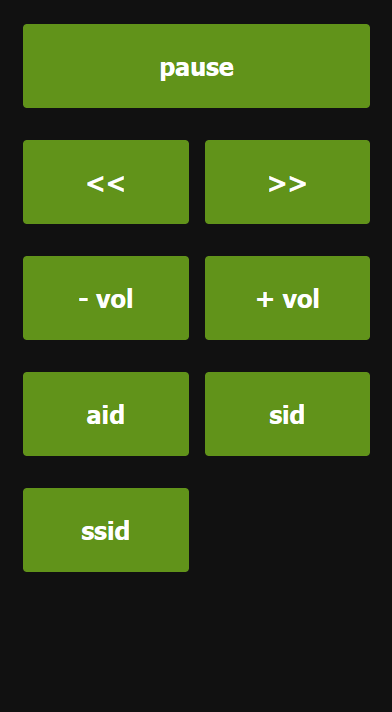

This script is heavily under development. I'm basically just adding functionality by my own need. I published the script for people who want something basic to hack around with. If you need a more serious mpv-remote I would recommend [open-dynaMIX/simple-mpv-webui](https://github.com/open-dynaMIX/simple-mpv-webui).

When you open mpv, this script will run a http server that will serve a basic remote web app at `0.0.0.0:8000/` (localhost). The server will forward any commands clicked by user to the mpv ipc socket to execute commands for the player. I haven't so far seen much use for other features than seek and pause(thus they are only features for now).

## Requirements
- Cargo and rustc to build the server binary

## Usage
1. build server `cargo build --release`
2. add the binary in `target/release/` to PATH
3. add `lua/mpv-remote.lua` to your mpv scripts
4. open any file with mpv
5. visit `192.168.x.x:8000`(replace x with your pc ip) from your phone browser that is connected to the same network
6. optionally save the website to your homescreen for quick access

If the remote website is not accessible make sure your computer/firewall/router doesn't block port 8000 for local network traffic.

